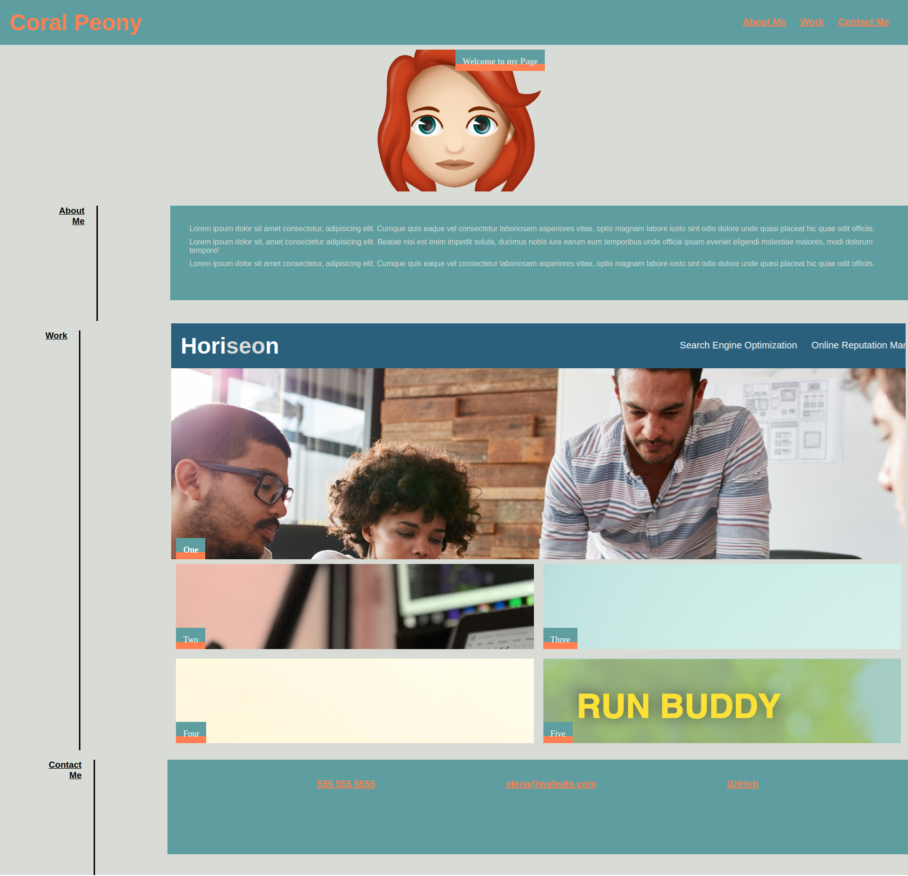

# Bootcamp: UK-VIRT-FE-PT-11-2022-U-LOLC-TWTH-1 Challenge Two

## Description

The task in this Challenge is to create a portfolio of work to showcase skills and talents to employers. 

In this portfolio I applied the core skills we've recently learned, such as flexbox, media queries, and CSS variables.

This portfolio highlights my first Challenge as the strongest work I've done so far. 

## Installation

N/A

## Usage

The website is built using HTML and CSS. To review the code, open the Chrome DevTools by pressing Command+Option+I (macOS) or Control+Shift+I (Windows). A console panel should open either below or to the side of the webpage in the browser. 

https://coralpeony.github.io/challenge_two_edementieva/

## Credits

N/A

## License

Please refer to the LICENSE in the repo.
